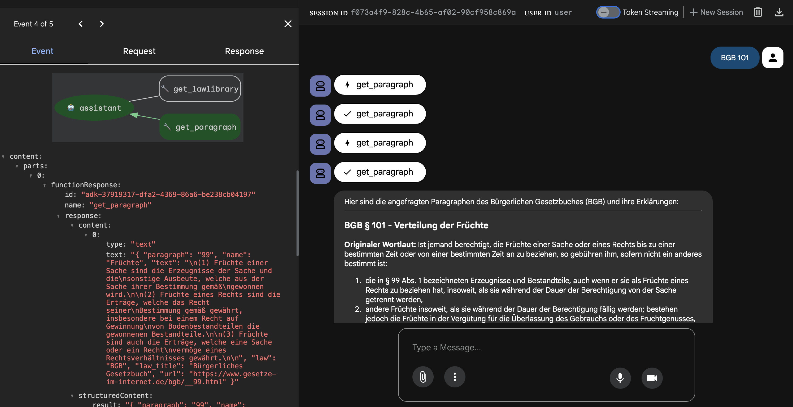

# Google ADK Agent - Deutscher Gesetzes-Experte

Dieser Agent demonstriert die Nutzung des **Google Agent Development Kit (ADK)** in Kombination mit dem **Model Context Protocol (MCP)**.

Der Agent agiert als Experte für deutsche Gesetzestexte. Er nutzt ein über MCP angebundenes Tool (`deutsche-gesetze-mcp`), um Gesetze zu recherchieren, Verweisen zu folgen und juristische Texte für Laien verständlich zu erklären.

## Funktionsweise

Der Agent ist so instruiert, dass er:
1.  Nach angeforderten Gesetzen oder Paragraphen sucht.
2.  Automatisch Querverweisen (Referenzen) in den Texten folgt und diese ebenfalls abruft.
3.  Die Originaltexte zitiert.
4.  Eine verständliche Erklärung liefert.
5.  Immer die URL zur Quelle (gesetze-im-internet.de) angibt.

Er verwendet dabei das Modell `gemini-2.5-flash`.

## Voraussetzungen

*   Python 3.10+
*   Installiertes `google-adk`
*   Zugriff auf Google Gemini Modelle (Vertex AI oder AI Studio API Key). Einen API Key kannst du unter [ai.google.dev/gemini-api/docs/api-key](https://ai.google.dev/gemini-api/docs/api-key) erstellen.
*   Interner oder externer Zugriff auf den konfigurierten MCP-Server (konfigurierbar über die Umgebungsvariable `MCP_URL`, Standard: `http://localhost:8001/mcp`).

## Installation & Nutzung

1.  **Installieren von `google-adk`:**
    ```bash
    cd google-adk-agent
    ```

2.  **Navigieren in das Verzeichnis:**
    ```bash
    cd google-adk-agent
    ```

3.  **Agent starten:**
    ```bash
    export GEMINI_API_KEY=<YOUR_API_KEY_HERE>
    export MCP_URL=http://localhost:8001/mcp
    adk web
    ```

## adk web



## Code-Struktur

Die Definition des Agenten befindet sich in `agent/agent.py`:

*   **`MCPToolset`**: Verbindet den Agenten mit dem externen MCP-Server.
*   **`LlmAgent`**: Konfiguriert den Agenten mit Modell (`gemini-2.5-flash`), Namen und spezifischen Instruktionen (System Prompt).

```python
# Auszug aus agent/agent.py
toolset = MCPToolset(connection_params=StreamableHTTPConnectionParams(url='...'))

root_agent = LlmAgent(
    model="gemini-2.5-flash",
    instruction="Du bist Experte für Deutsche Gesetzestexte...",
    tools=[toolset],
)
```
